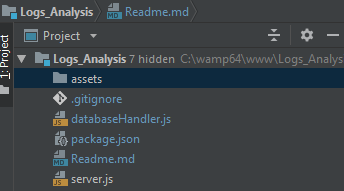

## Logs Analysis 

Is a log analysis tool which 
##Technologies 
<a href='https://nodejs.org/en/'>NodeJs<a> as server side language <br>
<a href='https://www.postgresql.org/'>PostgresSQL</a> as <a href='https://en.wikipedia.org/wiki/Database#Database_management_system'>DBMS<a>
### Project structure



#### server.js

#### databaseHandler.js

#### by three functions 
`What are the most  three popular three articles of all times ?` 

`What are the most popular article authors of all time ?` 

`On which days did more than 1% of requests lead to errors ? ` 

### Project dependencies
Install all the dependencies
 ```sh
$ npm install 
 ```


